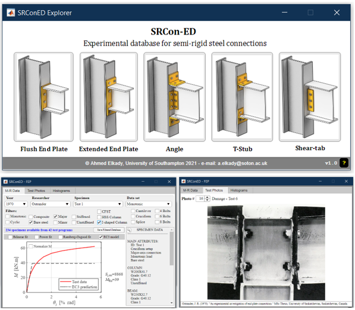

  

  

--------------

## SRConED
SRConED is an interactive interface for exploring and processing a recently-collated comprehensive experimental database for bare steel and composite semi-rigid (SR) connections. The current version of the database (v2.2302) include data for flush end-plate connections (FEP) covering more than 420 tests from 71 experimental programs. Data for other SR connections will be rolled out in future versions.

## Citation
Mak L. and Elkady A. (2021). "Experimental database on flush-end plate connections". ASCE Journal of Structural Engineering 147(7). DOI: [10.1061/(ASCE)ST.1943-541X.0003064](https://ascelibrary.org/doi/abs/10.1061/%28ASCE%29ST.1943-541X.0003064).

## Notes
* The current database explorer executable (SRConED-Explorer.exe) is only available for Windows-based machines. After installation, the software need to be opened directly from the installation directory.

* This database is being updated on a regular basis. Fork this repository to make sure you recieve all updates.

